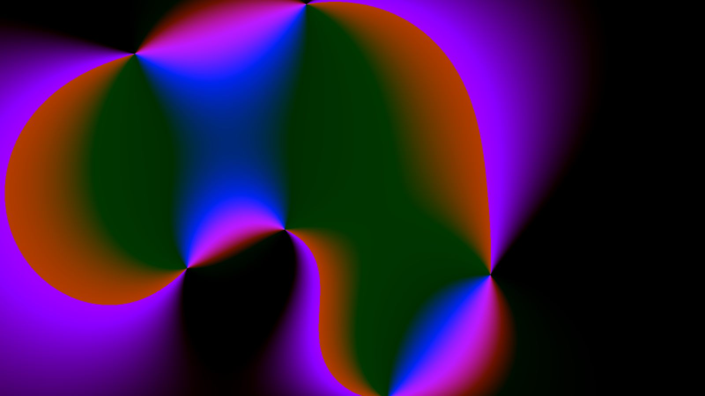

# Meromorphic Functions

A tool for generating static and animated mesh gradients using a [meromorphic function](https://en.wikipedia.org/wiki/Meromorphic_function).

Based on on Harley Turan's <a href="https://hturan.com/writing/complex-numbers-glsl">Visualizing Complex Numbers Using GLSL</a>.

### Getting Started

Install dependencies: `npm install`

Start storybook: `npm run storybook`
